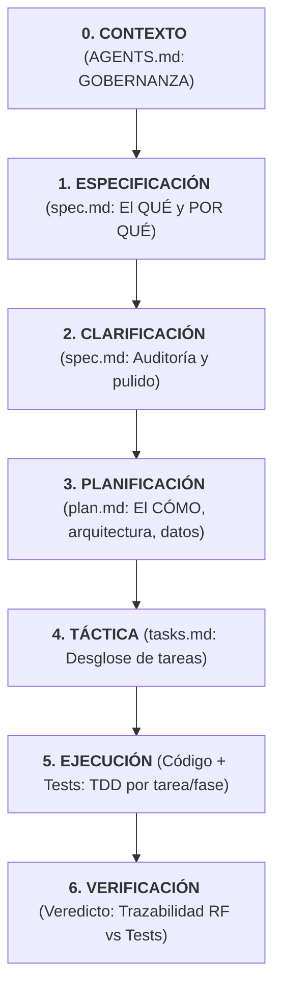

# 🧭 GVIDO

> *Gvido* es la palabra en esperanto para **"Guía"**.

**GVIDO** es un framework ligero y modular de **Spec-Driven Development (SDD)** diseñado exclusivamente para **OpenCode**. Permite guiar el desarrollo desde la definición de contexto y gobernanza hasta la especificación, planificación, ejecución TDD y verificación de cobertura.

---

## 🔄 Flujo de Trabajo GVIDO (0 a 6)

GVIDO estructura el ciclo de vida del desarrollo en 7 etapas progresivas:



| Etapa | Skill | Propósito | Entregable / Artefacto |
| :--- | :--- | :--- | :--- |
| **0. Gobernanaza** | `sdd-agent` / `sdd-constitution` | Definir rol del agente y reglas del proyecto | `AGENTS.md`, `constitution.md` |
| **1. Especificación** | `sdd-spec` | Definir el **Qué** y **Por qué** de la funcionalidad | `spec.md` |
| **2. Clarificación** | `sdd-clarify` | Auditar, detectar vacíos y pulir especificación | `spec.md` (revisado) |
| **3. Planificación** | `sdd-plan` | Definir el **Cómo**, arquitectura, modelos y datos | `plan.md` |
| **4. Táctica** | `sdd-tasks` | Desglosar el trabajo en lista ejecutable de tareas | `tasks.md` |
| **5. Ejecución** | `sdd-execute` | Escribir código y pruebas siguiendo ciclo TDD | Código + Pruebas unitarias/E2E |
| **6. Verificación** | `sdd-verify` | Auditar trazabilidad final entre Requisitos y Tests | Veredicto de Cobertura |

---

## ⚡ Instalación Rápida

Para instalar o actualizar GVIDO en la raíz de cualquier proyecto destino, ejecuta:

```bash
curl -fsSL https://raw.githubusercontent.com/walkeralfaro/gvido/main/scripts/install.sh | bash
```

---

## 📁 Estructura en el Proyecto Destino (`.opencode/`)

Al ejecutar la instalación, los recursos se inyectan en tu proyecto con las plantillas (*templates*) encapsuladas directamente dentro de cada carpeta `/assets`:

```text
tu-proyecto/
└── .opencode/
    ├── gvido-manifest.json
    └── skills/
        ├── sdd-agent/
        │   ├── SKILL.md
        │   └── assets/
        │       └── agent-template.md
        ├── sdd-constitution/
        │   ├── SKILL.md
        │   └── assets/
        │       └── constitution-template.md
        ├── sdd-spec/
        │   ├── SKILL.md
        │   └── assets/
        │       └── spec-template.md
        ├── sdd-clarify/
        │   └── SKILL.md
        ├── sdd-plan/
        │   ├── SKILL.md
        │   └── assets/
        │       └── plan-template.md
        ├── sdd-tasks/
        │   ├── SKILL.md
        │   └── assets/
        │       └── tasks-template.md
        ├── sdd-execute/
        │   └── SKILL.md
        └── sdd-verify/
            ├── SKILL.md
            └── assets/
                └── verify-template.md
```

---

## ⚙️ Opciones Avanzadas de Instalación

### Instalar una versión específica (Release Tag)
```bash
curl -fsSL https://raw.githubusercontent.com/walkeralfaro/gvido/main/scripts/install.sh | bash -s -- --tag v0.2.0
```

### Reemplazar archivos locales existentes (`--force`)
```bash
curl -fsSL https://raw.githubusercontent.com/walkeralfaro/gvido/main/scripts/install.sh | bash -s -- --force
```

---

## 📄 Licencia

Distribución bajo la [Licencia MIT](LICENSE).